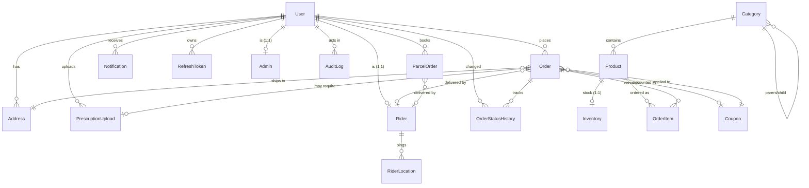

# Kaw Kaw — Database (ERD & relationships)

PostgreSQL via Prisma. Every model: UUID PK, `createdAt`, `updatedAt`, `deletedAt` (soft delete).
Source: [`services/api/prisma/schema.prisma`](../../services/api/prisma/schema.prisma).

## ERD

> `Setting` is standalone (key/value config). `AuditLog` references the acting `User` (nullable).

## Relationship notes

### User-centric
- **User is the identity root.** Role (`CUSTOMER/RIDER/ADMIN/SUPER_ADMIN/SUPPORT`) lives on `User`.
  `Rider` and `Admin` are **1:1 profile extensions** (`userId @unique`) holding role-specific data.
  This keeps one phone = one identity while allowing a user to be elevated to rider/admin.
- `RefreshToken` (1:N) implements session rotation/revocation; `jti` unique, `tokenHash` stored
  (never the raw token). Redis mirrors active jtis for fast checks but **PostgreSQL is authoritative**.

### Order relationships
- `Order` → `User` (customer), `Address` (delivery), optional `Rider`, optional `Coupon`.
- `OrderItem` snapshots `productName` + `unitPrice` at purchase time so historical orders are
  immutable even if the product later changes price or is deleted.
- `OrderStatusHistory` is an append-only audit of every lifecycle transition (with actor + note).
- `PrescriptionUpload` is optionally linked 1:1 to an `Order` (pharmacy flow).

### Inventory
- `Inventory` is **1:1 with Product** (`productId @unique`). Stock is decremented inside the
  order-placement transaction and restored on cancellation. `isInStock` is a denormalized flag
  kept in sync with `quantity` for fast catalogue filtering.

### Rider
- `Rider` 1:1 `User`; `RiderLocation` (1:N) is an append-only location history. Live location is
  cached in Redis (hot path) and the latest is denormalized onto `Rider.currentLatitude/Longitude`.

### Parcels
- `ParcelOrder` is self-contained (embeds pickup/drop/receiver fields) rather than referencing
  `Address`, because parcels use arbitrary one-off addresses, not the customer's saved book.

## Future scaling concerns & mitigations

| Concern | Risk | Mitigation (when needed) |
|--------|------|--------------------------|
| **`RiderLocation` growth** | High-frequency GPS pings → millions of rows | Time-partition by month or move to a TSDB; retain Redis hot cache; prune/rollup old rows via cron. Today: indexed on `(riderId, recordedAt)`. |
| **`AuditLog` / `OrderStatusHistory` growth** | Append-only, unbounded | Partition by `createdAt`; archive cold data to cheaper storage. |
| **`Notification` growth** | One row per event per user | TTL/prune read notifications older than N days. |
| **Soft-delete + unique columns** | `deletedAt` rows still occupy unique values (`phone`, `slug`, `sku`, `code`) | Acceptable for V1. If reuse needed, switch to partial unique indexes `WHERE "deletedAt" IS NULL`. |
| **Decimal money math** | Rounding drift | Stored as `Decimal(10,2)`; arithmetic rounded to 2dp server-side. Consider integer paise if multi-currency later. |
| **Hot product/category reads** | Catalogue read-heavy | Add Redis read-through cache or a read replica; current indexes cover `serviceType`, `categoryId`, `isFeatured`. |
| **Connection limits (Aiven)** | Many instances × Prisma pool | Use a pooler (PgBouncer / Prisma Accelerate / Aiven connection pooling) before scaling API replicas. |
| **Geo queries** | `service_radius` / nearest-rider scans | Lat/lng are plain floats today (Haversine in app). Add PostGIS + GiST index if geo queries become hot. |
| **Order number uniqueness** | Timestamp+random collision at very high volume | `orderNumber @unique` enforces it; collisions retry. Move to a sequence/snowflake if throughput demands. |

None of these block V1 at launch-city scale; they are the levers to pull as volume grows.
